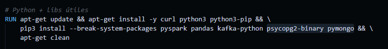

# 📦 Módulo de Base de Datos (Equipo 3 – Almacenamiento)

Este módulo contiene todo lo necesario para levantar las bases de datos del proyecto Big Data del Equipo 3:

- **PostgreSQL 15**
- **pgAdmin 4**
- **MongoDB 6**
- **Mongo Express**

Todo está contenido en un único archivo `docker-compose.yml` para evitar problemas de compatibilidad entre ramas.

Además, el archivo `info.txt` incluye el script del **consumidor Spark EVOLUCIONADO para insertar a las bdd** que debe copiarse dentro del contenedor Spark del módulo de procesamiento.

## 🚨 ADVERTENCIA IMPORTANTE (EN CASO DE SALIR ERROR AL EJECUTAR EL SPARK NUEVO)

Este módulo utiliza Spark + Kafka + PostgreSQL + MongoDB en contenedores Docker.
Para que todo funcione correctamente, DEBES cumplir dos requisitos críticos antes de ejecutar el proyecto.

⚠ 1) Verificar que los puertos NO estén ocupados

Si alguno de los siguientes puertos está siendo usado por otro servicio, Docker NO levantará los contenedores.

Puertos utilizados por este proyecto
Servicio	Puerto Local → Contenedor
PostgreSQL	5433 → 5432
pgAdmin	5050 → 80
MongoDB	27017 → 27017
Mongo Express	8087 → 8081

# ⚠ 2) Spark, PostgreSQL y MongoDB deben estar en la MISMA red Docker!!!
📌 Problema que descubrimos:

Si Spark está en la red bigdata_net
y las bases de datos están en la red basededatos_equipo3_iot_network
entonces Spark NO puede resolver los hostnames como:

postgres_iot

mongo_iot

Y provoca errores como:

psycopg2.OperationalError: could not translate host name "postgres_iot": Temporary failure in name resolution

📌 Solución correcta (ya aplicada en el docker-compose final):

Todos los contenedores deben estar en una sola red compartida, por ejemplo:

networks:
  bigdata_net:
    driver: bridge

Y cada servicio debe declarar:

networks:
  - bigdata_net

✔ ¿Cómo verificar que están en la misma red?

Ejecutar:

docker network inspect bigdata_net

Ahí deberán aparecer todos los CONTENEDORES:

spark-master

spark-worker

spark-submit

postgres_iot

mongo_iot

kafka

zookeeper

Si alguno NO está, Spark no podrá insertar en las BDD.

# 🔧 3) Unificar Spark y las Bases de Datos en una sola red Docker

Para que Spark pueda insertar en PostgreSQL y MongoDB, TODOS deben estar en la misma red Docker.
Si no, Spark NO puede resolver los hostnames:

postgres_iot

mongo_iot

Y marca errores como:

psycopg2.OperationalError: could not translate host name "postgres_iot"

✔ Cómo solucionarlo 

Tienes dos opciones, dependiendo de qué contenedor esté fuera de la red.

🅰️ OPCIÓN A — Mover Spark a la red de las bases de datos

Si Spark está en una red diferente (por ejemplo bigdata_net),
usa este comando:

docker network connect basededatos_equipo3_iot_network spark-submit
docker network connect basededatos_equipo3_iot_network spark-master
docker network connect basededatos_equipo3_iot_network spark-worker

Listo: Spark ahora ve a Mongo y PostgreSQL.

🅱️ OPCIÓN B — Mover las BDD a la red de Spark

Si Spark usa la red bigdata_net, entonces conecta:

docker network connect bigdata_net postgres_iot
docker network connect bigdata_net mongo_iot
docker network connect bigdata_net mongo_express_iot
docker network connect bigdata_net pgadmin_iot

📝 Cómo verificar que todo está OK

Ejecuta:

docker inspect spark-submit

Debes ver algo como:

"Networks": {
    "bigdata_net": {},
    "basededatos_equipo3_iot_network": {}
}

Si aparecen dos redes, está perfecto.

🎯 Recomendación del equipo

Usa una sola red unificada para evitar confusiones:

networks:
  bigdata_net:
    driver: bridge

Y en cada servicio:

networks:
  - bigdata_net

Así todos los contenedores:

Kafka

Spark

PostgreSQL

MongoDB

pgAdmin

Mongo Express

Están garantizados de poder comunicarse.

## 📁 **Contenido de esta carpeta**

| Archivo                | Descripción |
|-----------------------|-------------|
| `docker-compose.yml`  | Orquestación de PostgreSQL, pgAdmin, MongoDB y Mongo Express |
| `schema_postgres.sql` | Script SQL que crea todas las tablas relacionales |
| `mongo-init.js`       | Script de inicialización de MongoDB (colecciones e índices) |
| `test_postgres.py`    | Prueba rápida de conexión a PostgreSQL |
| `info.txt`            | Contiene el script actualizado del consumidor Spark (para copiar a su módulo) |
| `README.md`           | Este documento |

---

# 1️⃣ Requisitos previos IMPORTANTE

Antes de usar este módulo, debes tener instalado:

antes de compilar el spark se debe:
- PONER psycopg2-binary pymongo en el archivo Dockerfile.spark para que funcionen las librerias

esto instala las librerias para mongo y postgre, pero si ya lo iniciaste puedes hacerlo de nuevo, generar la build y solo se instalara eso sin que se instale todo de nuevo
- **Docker Desktop**
- **Python 3.10+**
- Librería necesaria para pruebas:

comando:
python -m pip install psycopg2-binary

# 2️⃣ Levantar la infraestructura de bases de datos

Navegar dentro de esta carpeta:

Emergentes_BigData/BaseDeDatos_Equipo3/

Y ejecutar:

docker compose up -d

Esto levantará:

🐘 postgres_iot

Base de datos PostgreSQL

Puerto expuesto: 5433:5432

Autocarga del script schema_postgres.sql

🖥 pgadmin_iot

Panel gráfico para PostgreSQL

Puerto: 5050:80

Acceso vía navegador

🍃 mongo_iot

Base de datos MongoDB

Puerto expuesto: 27017:27017

Ejecuta automáticamente mongo-init.js

🌐 mongo_express_iot

Panel web para MongoDB

Puerto: 8087:8081

Autenticación activada

Los contenedores se inician en la red interna del proyecto:

basededatos_equipo3_iot_network

# 3️⃣ Acceder a pgAdmin

Abrir en el navegador:

http://localhost:5050

Credenciales:

Email: admin@iot.com

Password: admin123

Registrar un nuevo servidor:

Campo	Valor
Name	PostgreSQL IoT
Host	postgres_iot
User	postgres
Password	12345
Database	SensoresIoT
# 4️⃣ Acceder a Mongo Express

Abrir:

http://localhost:8087

Credenciales:

User: admin

Password: admin123

La base se llama:

sensores_iot

Colecciones creadas automáticamente:

sensor

sensor_aire

sensor_sonido

sensor_soterrado

# 5️⃣ ¿Qué tablas/colecciones se crean automáticamente?
🐘 PostgreSQL (schema_postgres.sql)

sensor

sensor_aire

sensor_sonido

sensor_soterrado

Los índices también se configuran automáticamente.

🍃 MongoDB (mongo-init.js)

sensor

sensor_aire

sensor_sonido

sensor_soterrado

Todos con sus índices específicos.

# 6️⃣ Cómo ingresar manualmente a PostgreSQL
En la ruta de base de datos 3:

docker exec -it postgres_iot psql -U postgres -d "SensoresIoT"

Listar tablas:
\dt

Ver contenidos:
SELECT * FROM sensor;
SELECT * FROM sensor_aire;
SELECT * FROM sensor_sonido;
SELECT * FROM sensor_soterrado;

# 7️⃣ Cómo ingresar a Mongo desde consola

En la ruta de base de datos 3:

docker exec -it mongo_iot mongosh

Luego:

use sensores_iot
db.sensor.find().pretty()
db.sensor_aire.find().pretty()
db.sensor_sonido.find().pretty()
db.sensor_soterrado.find().pretty()

# 8️⃣ Relación con el módulo Spark (IMPORTANTE)

El archivo:

info.txt

contiene el script completo del consumidor Spark, encargado de leer Kafka y escribir en:

PostgreSQL (backup)

MongoDB (base principal)

Ese archivo debe ser copiado en su totalidad dentro del módulo de Spark (contenedor spark-submit) en la carpeta correspondiente.

⚠ Spark NO está dentro de este módulo.
⚠ Este README solo documenta la capa de almacenamiento.

